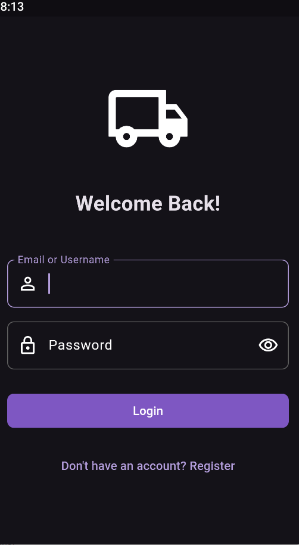
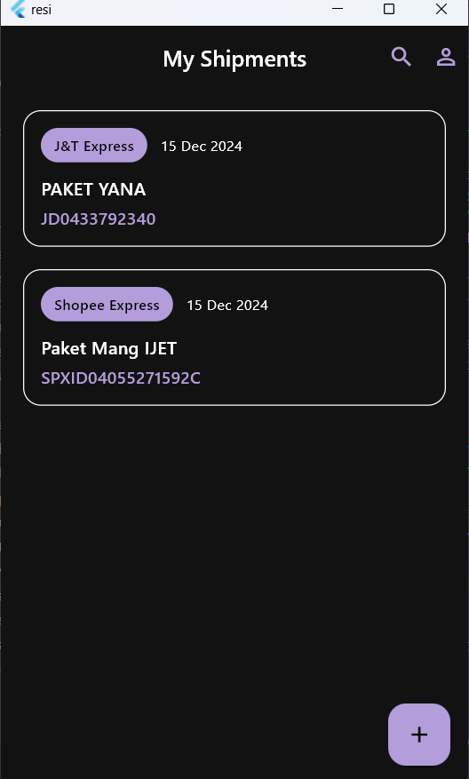
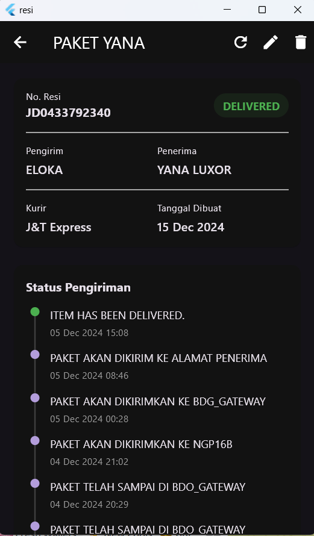
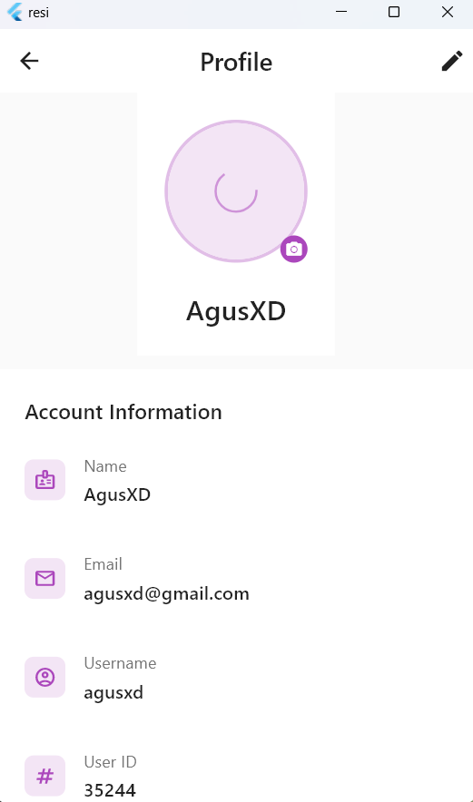

# RTrack

**RTrack** adalah aplikasi yang dirancang untuk pelacakan atau monitoring, dengan kemungkinan penggunaan Flutter untuk antarmuka pengguna dan Express.js untuk backend.

## Fitur
- Pelacakan secara real-time
- Dukungan platform lintas (Android, iOS, Web)
- Backend dengan Express.js

## Cara Memulai
1. Klon repositori:
   ```bash
   git clone https://github.com/agusydk3/RTrack.git
   ```
2. Instal dependensi untuk setiap platform:
   - Untuk Flutter:
     ```bash
     flutter pub get
     ```
   - Untuk Backend (Express JS):
     ```bash
     npm install
     ```

3. Jalankan aplikasi:
   - Flutter:
     ```bash
     flutter run
     ```
   - Express JS:
     ```bash
     npm start
     ```

## Screenshot





---
